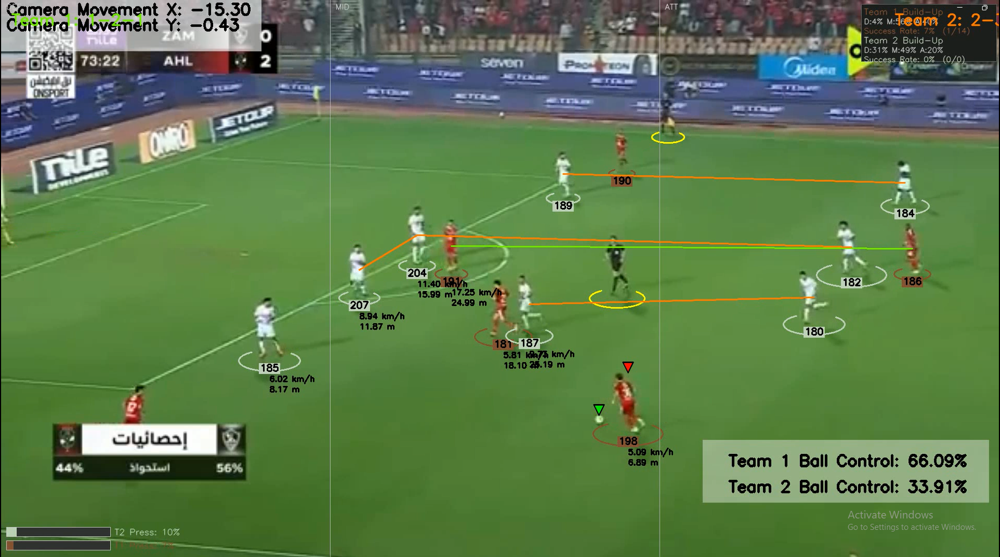

# AI-Powered Football Tactical Analysis System

An advanced Computer Vision and Machine Learning pipeline designed to extract tactical insights, player statistics, and match analysis directly from raw football match footage. 

This project builds upon basic object detection by introducing high-level tactical analytics, such as formation detection, press intensity analysis, and build-up phase tracking.

---

## Demo

---

## Key Features

### Advanced Tactical Analytics (Custom Built)
* **Formation Detector:** Dynamically identifies and classifies team formations (e.g., 4-3-3, 4-4-2) based on the spatial distribution of players across defense, midfield, and attack lines.
* **Press Intensity Analyzer:** Quantifies the defensive pressure applied to the ball carrier, calculating a "Press Intensity" percentage for each team.
* **Build-up Analyzer:** Segments the pitch into tactical zones (Defense, Midfield, Attack) and tracks where a team spends their possession time, calculating phase success rates.
* **Progressive Pass Detector:** Identifies and flags line-breaking and progressive passes.

### Core Vision & Tracking
* **Multi-Object Tracking:** Robust tracking of players, referees, and the ball using custom-trained YOLO models and ByteTrack.
* **Camera Movement Estimation:** Calculates and compensates for camera panning and zooming using Optical Flow to ensure precise real-world physics calculations.
* **Perspective Transformation (View Transformer):** Converts 2D pixel coordinates from the camera's perspective into a top-down 2D pitch view using homography matrices.
* **Automatic Team Assignment:** Uses K-Means clustering to automatically group players into teams based on their dominant jersey colors.
* **Ball Possession System:** Calculates distance between player bounding boxes and the ball to dynamically assign possession and track overall team possession percentages.
* **Speed & Distance Estimation:** Translates pixel movement to real-world meters to calculate total distance covered and current running speed (km/h) for every player.

---

## Tech Stack
* **Python 3.x**
* **YOLO (Ultralytics):** For object detection (Players, Referees, Ball).
* **OpenCV:** For video processing, perspective transformation, and drawing annotations.
* **ByteTrack (Supervision):** For consistent multi-object tracking across frames.
* **Scikit-Learn:** For K-Means clustering (Team color assignment).
* **Pandas & NumPy:** For data interpolation and mathematical calculations.

---

## Project Structure

```text
FOOTBALL_ANALYSIS/
├── __pycache__/
├── Bildupanalyzer/                 # Custom tactical module: Build-up phases
├── camera_movement_estimator/      # Optical flow logic to adjust bounding boxes
├── development_and_analysis/       # Notebooks for development and testing
├── input_videos/                   # Place your raw match footage here
├── models/                         # Custom trained YOLO weights (e.g., players.pt)
├── output_videos/                  # Annotated output videos are saved here
├── player_ball_assigner/           # Logic to assign the ball to the closest player
├── PressIntensityAnalyzer/         # Custom tactical module: Pressing metrics
├── ProgressPassD/                  # Custom tactical module: Progressive pass detection
├── speed_and_distance_estimator/   # Real-world physics calculations
├── stubs/                          # Pickled data to save processing time
├── team_assigner/                  # K-Means clustering logic for jersey colors
├── trackers/                       # YOLO tracking logic
├── training/                       # Scripts and notebooks for training custom models
├── utils/                          # Helper functions for video I/O and bounding box math
├── view_transformer/               # Perspective transformation logic
├── .gitignore                      # Ignored files and directories for Git
├── main.py                         # The main execution script
├── README.md                       # Project documentation
└── yolo_inference.py               # Inference script for testing YOLO model# FootballAnalytics1
# FootballAnalytics1
# FootballAnalytics1
